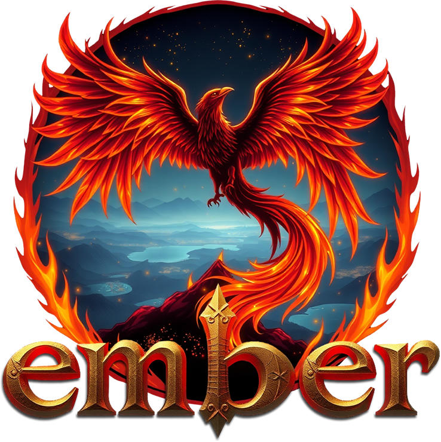

<p align="center">
<br />
<h2 align="center">🔥 High-performance, distributed emulator for WoW 1.12</h2>
<p align="center">
<a href="https://github.com/EmberEmu/Ember/actions/workflows/docker-image.yml"></a>
<a href="https://ci.appveyor.com/project/Chaosvex/ember/branch/development"></a>
</p>
</p>
<p align="center">
<a href="https://discord.gg/WpPJzQS"></a>
</p>
Ember is an educational and research emulation project undertaken to investigate MMO server architectures and bleeding-edge language standards and tooling. 

While many emulators aim for feature parity over quality of implementation, Ember strives for quality and performance first, while targeting modern platforms and toolchains.

## ❓ FAQ
### Is Ember a fork of an existing emulator?
No. Ember has been written from the ground up with zero code reuse from other cores. However, more mature projects still offer invaluable insights into the protocols and formats used.
### Why WoW 1.12.1?
Our primary goal isn't to produce a feature-complete, up-to-date emulator to use with newer clients. The 1.12.1 protocol was chosen as a fixed target to leverage the extensive research of prior projects, allowing for greater focus on writing code over reverse engineering.
### There are more mature emulators out there. What's the point?
Ember is a project open to new ideas, without aversion to rethinks about the best way to approach the challenges of server emulation. Being unencumbered by technical debt accrued by existing cores that are based on forks of early 2000s codebases allows Ember to take fresh approaches without worrying too much about how much we're going to break in the process. Some of those approaches have made their way to other projects!
### Research emulation project? What's there to research?
Aside from emulation techniques, WoW is an old game but it still hides many secrets. Ember focuses on quality of implementation and that includes trying to figure things out that other projects haven't. As a result of work on Ember, WoW emulation is slightly more complete and accurate than it would have otherwise been. Some examples include...
* Patches for serious authentication vulnerabilities in most major cores. [Write-up here](https://gist.github.com/Chaosvex/b62d8e7c24e60435b3834b5ec6b610a4).
* Client integrity validation (implemented by most major cores, based on Ember)
* Two-factor authentication (same as above)
* A more complete understanding of the authentication protocol, including implementation fixes that solved spurious login failures on other cores
* A multitude of message structure fixes that have been given directly to other projects, allowing cleaner implementations of game features (e.g. NPC emotes following player interactions)
* Correct character customisation options validation

Advancements in open source emulation flow in both directions, allowing the wider community to benefit, even if they all don't directly use or contribute to the same projects.
### Anything else I should know?
We have a retro ASCII-art banner straight from 1995 when the server runs. Priorities.

## ⚡ I'm in! What now?
### Docker Quick Start

Ember uses Docker to make it easy to get the project up and running within minutes. Once you have Docker (version 19 and up) installed, simply run...

**Docker 19:**

Linux & MacOS:

```bash
DOCKER_BUILDKIT=1 docker build <path to Dockerfile>
```

Windows:

```cmd
set "DOCKER_BUILDKIT=1" && docker build <path to Dockerfile>
```

Ember uses `DOCKER_BUILDKIT=1` to enable experimental features in Docker 19 that allow for build caching. It can be omitted by setting it as an environmental variable.

**Docker 20+:**
```
docker build <path to Dockerfile>
```

Want to do it the hard way? No problem, just see docs/GettingStarted.md.

## 💡Need help?

We have a Discord server over at [https://discord.gg/WpPJzQS](https://discord.gg/WpPJzQS) or you can check [our website](https://mmoemulator.com) out for further documentation.

## 💻 Supported platforms

Ember aims to support the following platforms as a minimum:

| Operating System  | Architectures |
| :------------ |:---------------:|
| Linux         | x86, x64, ARMv7 |
| Windows       | x86, x64        |
| Mac OS        | x86, x64        |

## ⚙️ Supported compilers

Any compiler version equal or greater than the supported version should be capable of compiling Ember.
|       |  Supported  |   Minimum   |
|-------|:-----------:|:-----------:|
| MSVC  | 19.30 (VS2022) | 19.30 (VS2022) |
| Clang |     18     |     18     |
| GCC   |     14     |     14     |

> [!NOTE]
> Minimum versions support all language features required to build the project but will not receive any fixes to support their continued use (e.g. compiler-specific workarounds).

## 📃 Language standards support

Ember currently targets C++26. The use of future language additions is permitted (e.g. technical specifications and drafts) as long as all three supported compilers provide a reasonable level of support.

## 🛠️ Build status

|  | master  | development |
| :------------ |:---------------:|:---------------:|
| GitHub   | [](https://github.com/EmberEmu/Ember/actions/workflows/docker-image.yml)| [](https://github.com/EmberEmu/Ember/actions/workflows/docker-image.yml) |
| AppVeyor | [](https://ci.appveyor.com/project/Chaosvex/ember/branch/master) | [](https://ci.appveyor.com/project/Chaosvex/ember/branch/development)  |
| Coverity | [](https://scan.coverity.com/projects/5653) | [](https://scan.coverity.com/projects/5653) |

##  💤 License

This project is licensed under the Mozilla Public License Version 2.0. A full copy of the license can be found in LICENSE or [by clicking here](http://mozilla.org/MPL/2.0/).
